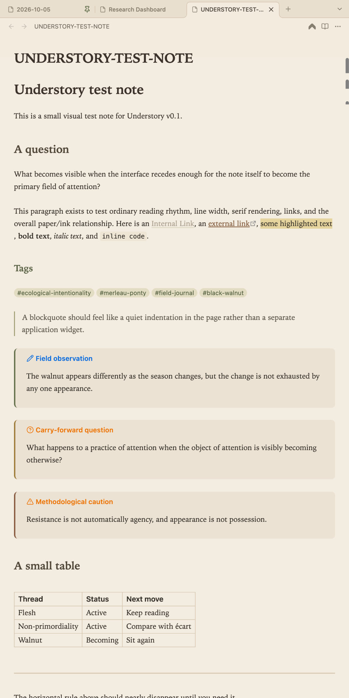
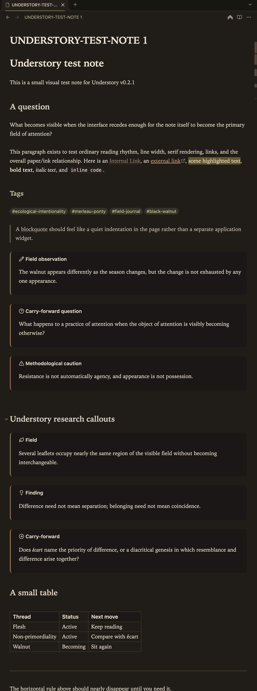

# Understory

[](https://doi.org/10.5281/zenodo.23176386)

**Understory** is a warm, quiet Obsidian theme for long-form reading, research, field notes, and writing.

Current release: **v0.2.1**.

It uses a parchment / walnut / moss visual language, with a light mode inspired by field notebooks and a dark mode built around walnut-shell browns rather than pure black.

## Design principles

- The note should remain the foreground.
- Interface chrome should recede.
- Color should differentiate, not decorate.
- Long-form reading should feel closer to a book than a dashboard.
- Research vocabulary can be supported visually without turning the vault into a taxonomy carnival.

## Screenshots

### Light mode



### Dark mode



## Features

- warm parchment light mode
- walnut-shell dark mode
- serif reading / writing typography
- restrained moss and autumn accents
- tuned long-form reading width and line height
- quiet sidebars, tabs, tags, tables, and graph defaults
- native research callouts:
  - `field`
  - `finding`
  - `carry-forward`

## Local installation

Copy the `Understory` folder into:

`.obsidian/themes/Understory/`

Then select **Understory** in Obsidian under:

Settings → Appearance → Themes

## Research callouts

```markdown
> [!field] Field observation
> What appeared before interpretation?

> [!finding] Finding
> A claim that has earned enough support to carry forward.

> [!carry-forward] Carry-forward question
> What should remain live in the next reading, sit, or writing session?
```

## Status

Understory is under active development and is being tested in a working research vault rather than designed only from mockups.

## License

MIT
